

  
  <h1><b>มหาวิทยาลัยเกษตรศาสตร์วิทยาเขตศรีราชา</b></h1>
   

> [!NOTE]
> ส่งงาน project วิชา Software Construction ปี 2 ภาคต้น

### เวลาที่ใช้ในการทำโปรเจคทั้งหมด

### รายละเอียดโปรเจค
*โปรเจคนี้ทำโปรแกรมเกี่ยวกับร้านขายหนังสือตามร้านขายหนังสือทั่วๆไปโปรแกรมใช้งานแบบง่ายๆมีระบบ POS ที่เข้าใจง่ายไม่ยากไม่ซับซ้อน
โดยเขียนด้วยภาษาโปรแกรมภาษา Java ในการสร้างหน้า GUI แล้วควมคุมการทำงานของโปรแกรม
และใช้ภาษาคือ SQL สำหรับการ สร้าง, อ่าน, อัปเดต, ลบ (CRUD Operations) ข้อมูลหนังสือจากในฐานข้อมูล*

---

### ฟีเจอร์ของโปรแกรม
1. รบบ Login, Logout, Register, User settings
2. การเชื่อมต่อกับฐานข้อมูล MYSQL จริงๆเพื่อนำไปใช้งาน
3. การเพิ่มข้อมูลสินค้า
4. การแก้ไขข้อมูลสินค้า
5. การลบข้อมูลสินค้า
6. การพรีวิวดูข้อมูลสินค้า
7. ระบบการสั่งซื้อสินค้า
8. มีตารางประวัติแสดงการสั่งซื้อสินค้าทั้งหมด
9. การพิมพืใบเสร็จสั่งซื้อสินค้า

---

### ประโยชน์ของโปรแกรม
1. สามารถนำเอาไปเป็นตัวอย่างโปรแกรมในการพัฒนาโปรแกรมประเภทนี้ต่อๆไปได้
2. สามารถนำเอาโปรแกรมนี้ไปใช้ในการจัดการร้านขายหนังสือได้

---

### สมาชิกในกลุ่ม
1. นางสาว อัมพุชินี บุญรักษ์
2. นาย วรินทร์ สายปัญญา
3. นาย ปัณณวัฒน์ นิ่งเจริญ
4. นาย ปุณณภพ มีฤทธิ์

---

### ภาพตัวอย่างโปรแกรม

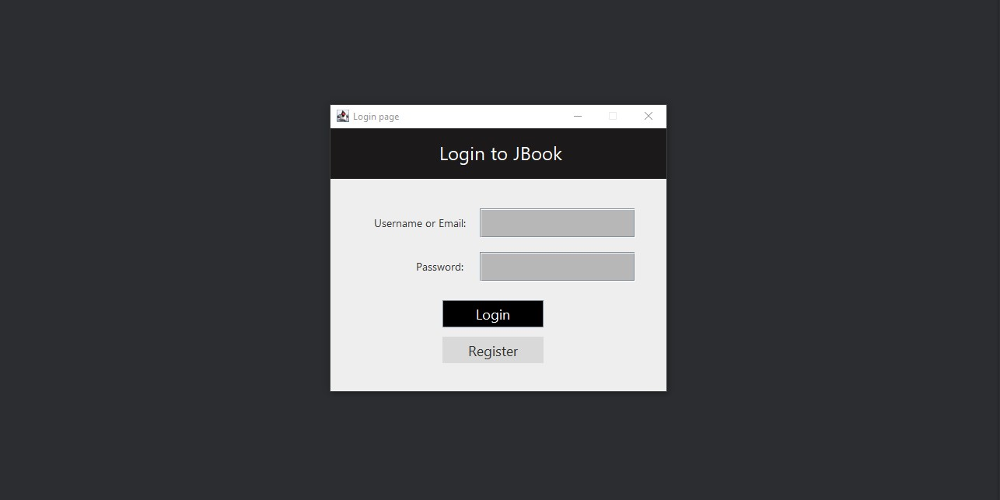
1. หน้า Login

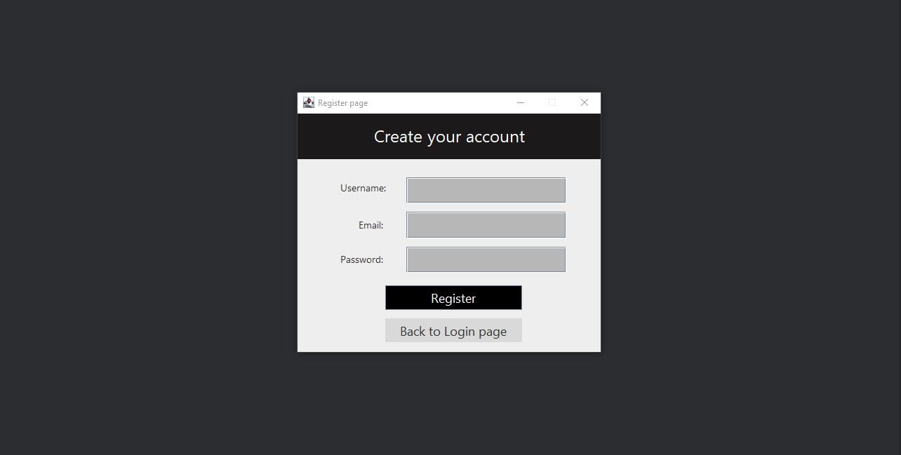
2. หน้า Register

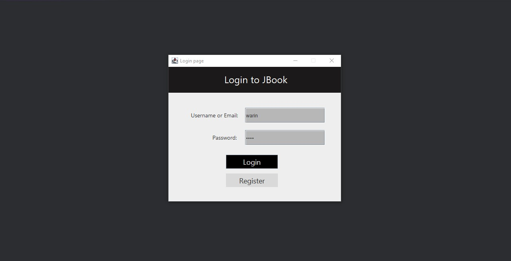
3. ใช้บัญชีผู้ใช้งาน login เข้าโปรแกรม (ต้องมีข้อมูลผู้ใช้งานอยู่ในฐานข้อมูลไม่งั้นจะไม่สามารถ login เข้าใช้งานได้)

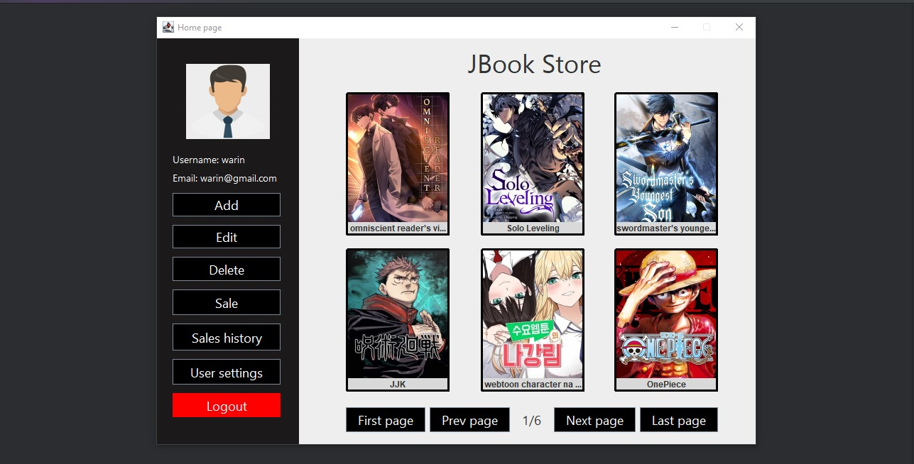
4. หน้า Home หรือ หน้าโปรแกรมหลัก จะมีข้อมูลหนังสือและปุ่มเพิ่อกดใช้งาน

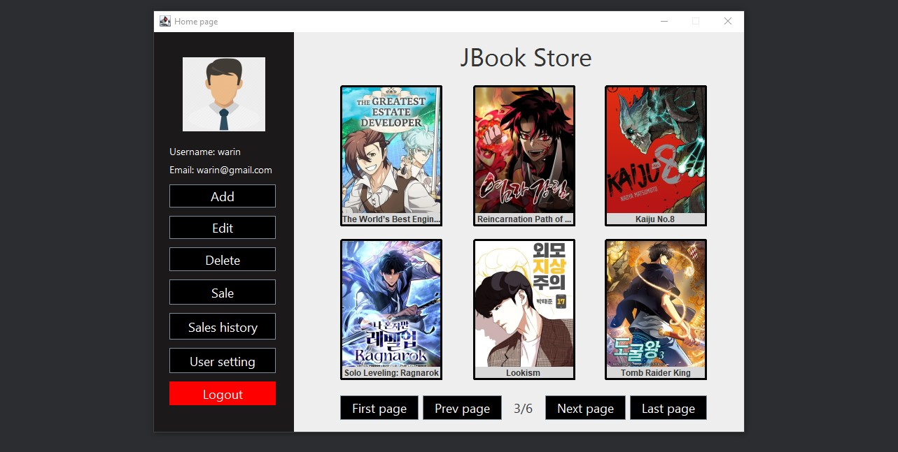
5. สามารถกดดูพรีวิวหนังสือได้ซึ่งจะแสดงข้อมูลหนังสือเล่มนั้นอย่างระเอียด โดยจะมีปุ๋ม edit, delete และ close ด้วย

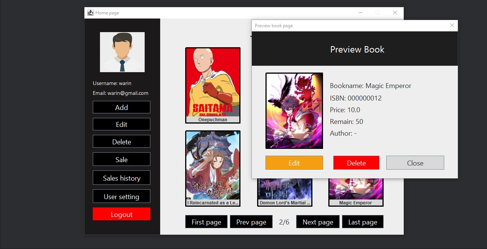
6. ถ้ากดปุ่ม edit จะแสดงหน้าต่างแบบฟอร์มขึ้นมาให้แก้ไข

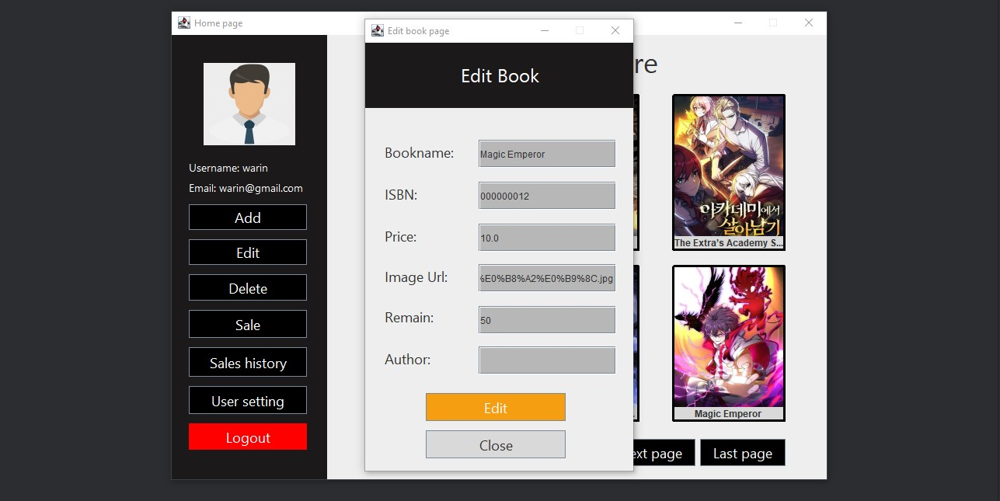
7. ถ้ากดปุ่ม delete จะแสดงข้อความถามผู้ใช้งานให้แน่ใจว่าจะลบหนังสือนี้ทิ้งจริงๆ

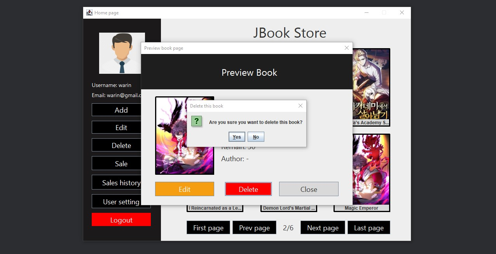
8. สามารถกดเลื่อน page ไปยังหน้าถัดๆไปได้หรือถอยหลังเพื่อดูข้อมูลหน้งสือเล่มอื่นๆได้

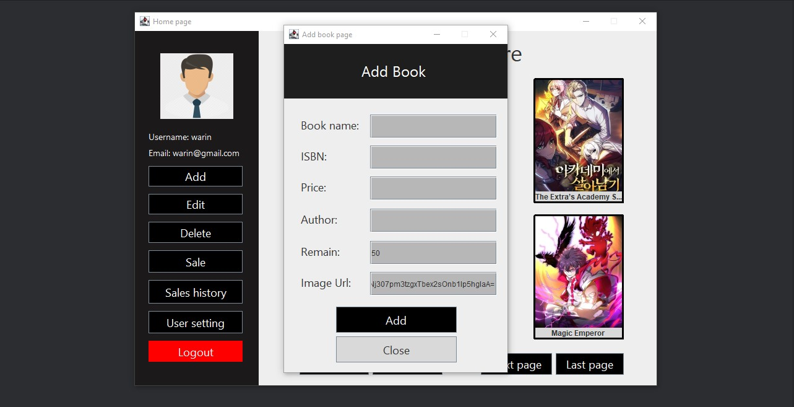
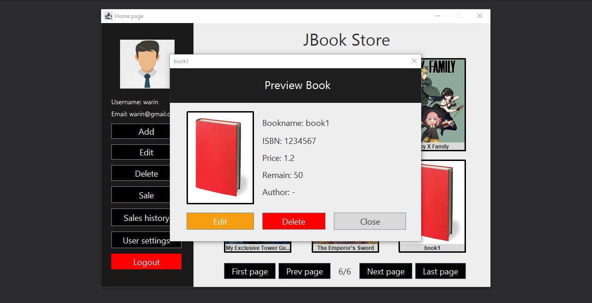
9. เมื่อกดปุ่ม add ตรงส่วน sidebar จะแสดงแบบฟอร์มให้กรอกข้อมูลแล้วถ้ากดปุ่ม add ตรงหน้าแบบฟอร์มจะเพิ่มข้อมูลหน้งสือเล่มใหม่ลงฐานข้อมูล

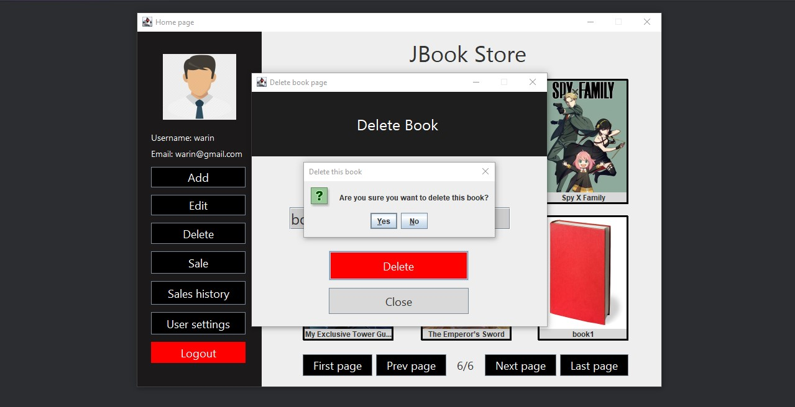
10. เมื่อกดปุ่ม delete ตรงส่วน sidebar จะแสดงหน้าต่างแล้วให้กรอกชื่อหนังสือหรือรหัส isbn ถ้ากรอกแล้วเจอข้อมูลจะแสดงข้อความว่าต้องการลบหรือไม่

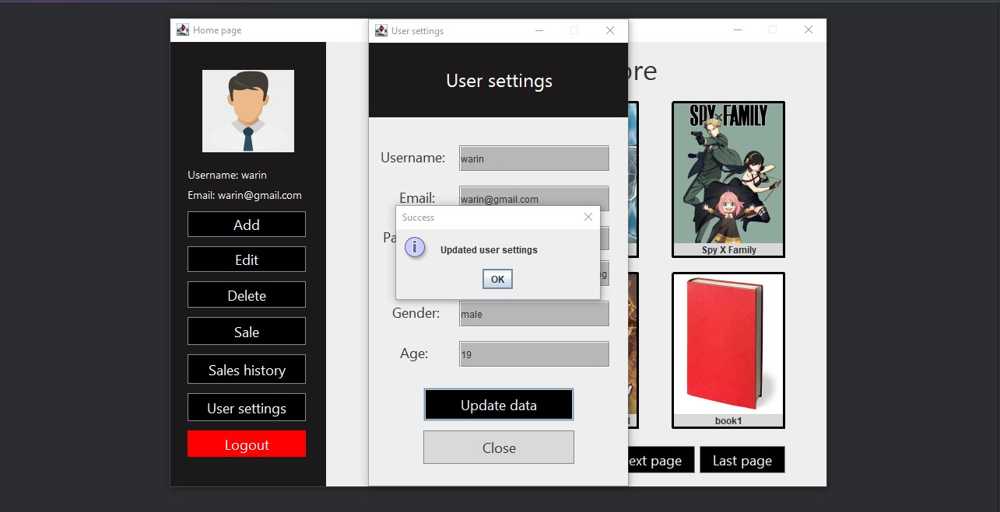
11. เมื่อกดปุ่ม user settings ตรงส่วน sidebar จะแสดงข้อมูลผู้ใช้งานให้ขึ้นมาดูแล้วเราสามารถกดแก้ไขข้อมูลได้